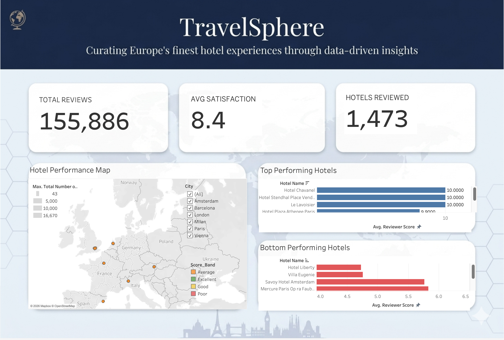
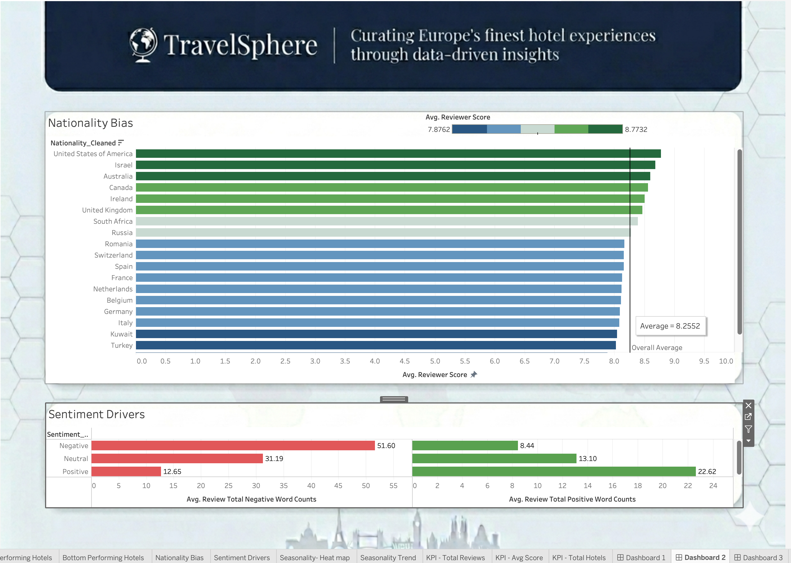
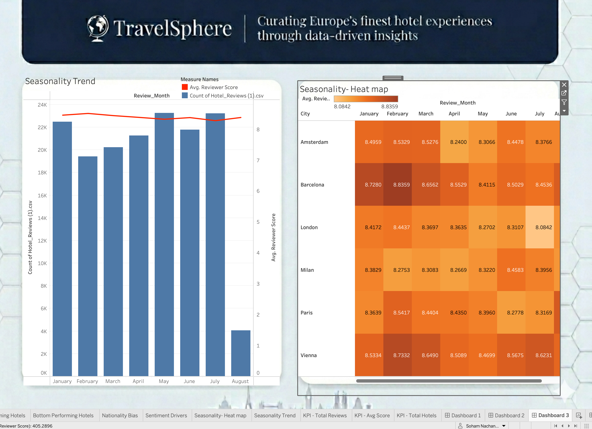

# TravelSphere Hotel Analysis 🏨
## 📊 Live Interactive Dashboard

A Tableau dashboard analysing Europe's finest hotel experiences through data-driven insights.

## Overview
- **Total Reviews:** 155,886
- **Avg Satisfaction Score:** 8.4
- **Cities Covered:** Amsterdam, Barcelona, London, Milan, Paris, Vienna

## Dashboards

## Tools Used
- Tableau
- SQL
- CSV Data

## Key Analysis
- Hotel performance by city and seasonality
- Top & bottom performing hotels
- Nationality bias in reviews
- Sentiment analysis of guest feedback
- KPI tracking for reviews, scores, and total hotels
